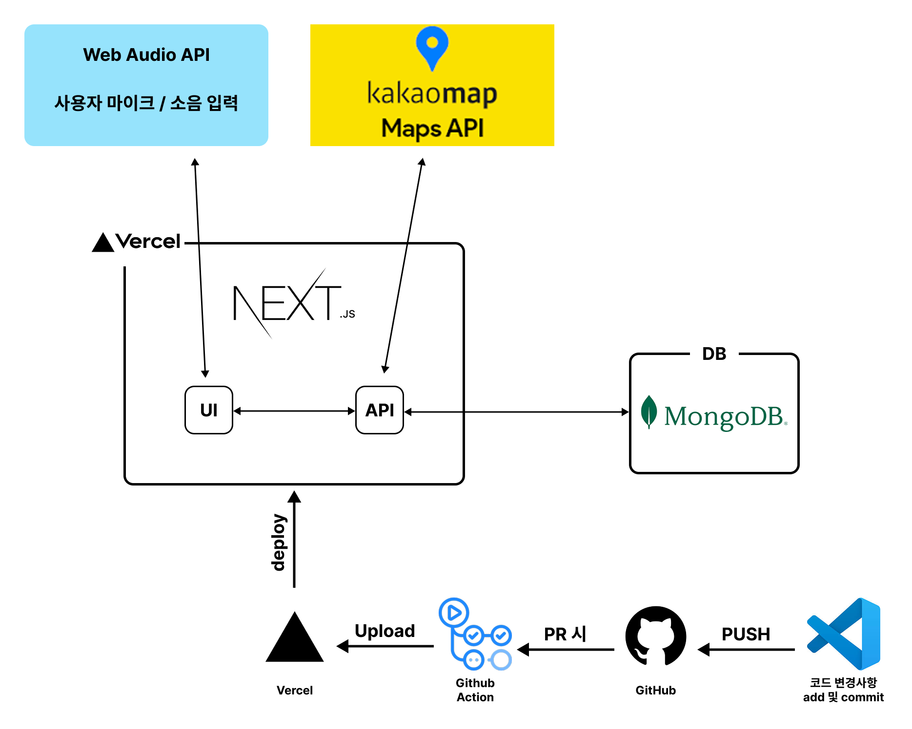
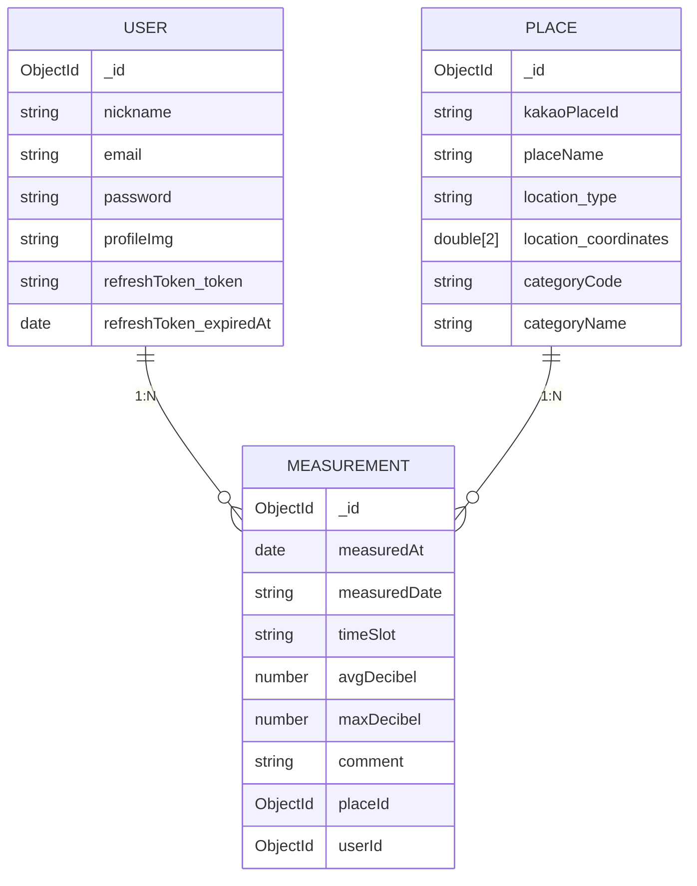

# 소리숲 Frontend

## 🚀 목차

- [1. 프로젝트 소개](#-프로젝트-소개)
- [2. 프로젝트 일정](#-프로젝트-일정)
- [3. 시스템 아키텍쳐](#-System-Architecture)
- [4. 패키지 구조](#-패키지-구조)
- [5. 데이터 구조(Schema)](#-Database-Schema)
- [6. API 명세서](#-API-명세서)
- [7. 기술 스택](#-Tech-Stack)
- [8. 개선 사항](#개선-사항)


## 📜 프로젝트 소개
**Soridam 프로젝트**는 측정된 소음 데이터를 시각화하여 지도에서 주변 장소의 소음 수준을 한 눈에 파악할 수 있는 플랫폼입니다.  
- **Vercel**: [https://soridam-one.vercel.app/](https://soridam-one.vercel.app/)  
- **Storybook**: [https://68b18c520a82ac63f9524bc5-rueqmotjmh.chromatic.com/?path=/docs/configure-your-project--docs](https://68b18c520a82ac63f9524bc5-rueqmotjmh.chromatic.com/?path=/docs/configure-your-project--docs)  
- **Design-system 관련 repo**: [https://github.com/elvinleeys/soridam_storybook?tab=readme-ov-file](https://github.com/elvinleeys/soridam_storybook?tab=readme-ov-file)

[맨 위로](#-목차)

## 📅 프로젝트 일정
### 1차 기간

| **항목** | **기간** |
|:----------:|:----------:|
| 기획 아이디어 공유 | 2024.12.04 |
| 배경조사, 문제 정의, 가설 설정 공유 | 2024.12.05 |
| 기획 | 2024.12.08 ~ 2025.12.13 |
| 해커톤(개발) | 2024.12.15 |
| 보완 개발 | 2024.12.18 ~ 2025.03.11 |

### 2차 기간(개인 프로젝트로 전환)
- **Design-System 개발**

| **항목** | **기간** |
|:----------:|:----------:|
| 개발 및 StoryBook을 활용한 문서화 | 2025.08.05 ~ 2025.08.26 |
| CI/CD 구축 및 코드 수정 | 2025.08.27 ~ 2025.08.31 |
| Chromatic 및 npm 패키로 배포 | 2025.09.01 |
| Refactoring | 2025.09.01 ~ 현재 |

- **본 프로젝트 개발**

| **항목** | **기간** |
|:----------:|:----------:|
| 프로젝트 관련 boiler plate 작성 | 2025.09.02 |
| 소음 측정 화면(main) 구현 | 2025.09.04 ~ 2025.09.09 |
| 소음 데이터 등록 화면 구현 | 2025.09.09 ~ 2025.09.11 |
| 소음 지도(map) 화면 구현 | 2025.09.11 ~ 2025.09.13 |
| 소음 데이터 리스트 화면(save) 구현 | 2025.09.13 ~ 2025.09.15 |
| 로그인 및 회원가입 구현 | 2025.09.15 ~ 2025.09.17 |
| api 연동 | 2025.09.17 ~ 2025.09.29 |
| Refactoring | 2025.09.29 ~ 현재 |

[맨 위로](#-목차)

## 🖥 System Architecture




## 📁 패키지 구조
```bash
.github                   : Github action 관련 yml 파일
└─ workflows
   └─ node.js.yml
sorisoop_fe
├─ src
│  ├─ app
│  │  ├─ (main)        : NavBar가 존재하는 페이지
│  │  └─ (no-nav)     : NavBar가 존재하지 않는 페이지
│  ├─ api              : API route
│  ├─ DynamicImport.tsx : dynamic import 명시
│  ├─ layout.tsx       : root Layout
│  ├─ not-found.tsx    : 404 페이지
│  └─ QueryClientProvider.tsx : React Query Provider
├─ components         : 컴포넌트
│  ├─ animate         : 애니메이션 관련 컴포넌트
│  ├─ clientOnlyPortal : Portal 관련
│  ├─ header, modal, loading, ...
├─ hook               : hook 함수
├─ lib                : db, fetchWrapper 등
├─ mixin              : 자주 사용되는 tailwind 변수 모음
├─ model              : DB Schema model
├─ services           : API fetch 함수
├─ store              : zustand store
├─ types              : DTO 및 global.d.ts 모음
├─ util               : 유틸 함수 모음
├─ doc                : ReadMe 관련 사용할 이미지/영상
├─ README.md          : 프로젝트 ReadMe
```

[맨 위로](#-목차)

## 🧱 Database Schema

프로젝트는 MongoDB를 기반으로 하며, Mongoose 스키마를 통해 명시적으로 데이터 구조를 정의합니다.  
다음은 주요 모델 간의 관계를 나타낸 ERD입니다.



### ✅ 4️⃣ 핵심 요약 (README용 문장)

> - `User`: 회원 정보 및 Refresh Token 관리  
> - `Place`: KakaoMap 기반의 장소 정보 저장 (GeoJSON 좌표 포함)  
> - `Measurement`: 사용자 및 장소를 참조하며, 시간대별 소음 측정 데이터를 기록  
> - 관계:  
>   - **User (1) → (N) Measurement**  
>   - **Place (1) → (N) Measurement**

[맨 위로](#-목차)

## 📝 API 명세서
1. Auth(user의 회원가입/로그인/로그아웃/회원탈퇴)
- Base URL: /api/auth

### 회원가입 (Sign Up)
- **POST /api/auth/sign-up** (회원가입)

- 요청 본문	
```js
{ 
    "email": string, 
    "password": string, 
    "nickname": string 
}
```

- 응답 코드	
201 Created — 회원가입 성공</br>
400 Bad Request — 필드 누락</br>
409 Conflict — 이미 등록된 이메일</br>

- 응답 예시	
```js
{
  "message": "회원가입 성공",
  "userId": "652a4a8dcb9e5b8e0c47b2a1"
}
```


- **POST /api/auth/check-email** (이메일 중복 확인)
- 요청 본문	
```js
{ "email": string }
```

- 응답 코드	
200 OK</br> 
400 Bad Request</br>

- 응답 예시	
```js
{
  "exists": false,
  "message": "Email available"
}
```
or

```js
{
  "exists": true,
  "message": "Email already registered"
}
```

### 로그인 (Sign In)

- **POST /api/auth/sign-in**
- 요청 본문	
```js
{ 
    "email": string, 
    "password": string 
}
```

- 응답 코드	
200 OK — 로그인 성공</br>
401 Unauthorized — 인증 실패</br>
500 Internal Server Error — 서버 오류</br>

- 응답 본문	
```js
{
  "accessToken": "string..."
}
```

[맨 위로](#-목차)

### 로그아웃 (Logout)

- **POST /api/auth/logout**
- 요청 헤더	
자동으로 refreshToken 쿠키 포함

- 응답 코드	
200 OK </br> 
500 Internal Server Error</br>

- 응답 예시	
```js
{
  "message": "로그아웃 성공"
}
```

[맨 위로](#-목차)

### 회원 탈퇴 (Delete Account)
- **DELETE /api/auth/delete**
- 요청 헤더	
자동으로 refreshToken 쿠키 포함

- 응답 코드	
200 OK — 탈퇴 성공</br>
401 Unauthorized — 유효하지 않은 토큰</br>
500 Internal Server Error — 서버 오류</br>

- 응답 예시	
```js
{
  "message": "회원 탈퇴가 완료되었습니다."
}
```

[맨 위로](#-목차)

2. Register(user의 소음데이터 측정 및 등록)
### 위치 찾기(측정 화면)
- **GET /api/location**
- Request Parameters
<table>
    <thead>
        <tr>
            <td>
                Name
            </td>
            <td>
                Type
            </td>
            <td>
                Required
            </td>
            <td>
                Description
            </td>
        </tr>
    </thead>
    <tbody>
        <tr>
            <td>
                x
            </td>
            <td>
                string
            </td>
            <td>
                ✅
            </td>
            <td>
                경도 (longitude)
            </td>
        </tr>
        <tr>
            <td>
                y
            </td>
            <td>
                string
            </td>
            <td>
                ✅
            </td>
            <td>
                위도 (latitude)
            </td>
        </tr>
    </tbody>
</table>

- Response
✅ 200 OK
```js
{
  "kakaoPlaceId": "123456789",
  "placeName": "스타벅스 강남역점",
  "location": {
    "type": "Point",
    "coordinates": [127.027636, 37.497950]
  },
  "categoryCode": "CE7",
  "categoryName": "카페"
}
```

⚠️ 200 (Fallback - no place found)
```js
{
  "kakaoPlaceId": null,
  "placeName": "서초동 1303-37",
  "location": {
    "type": "Point",
    "coordinates": [127.027636, 37.497950]
  },
  "categoryCode": null,
  "categoryName": null
}
```

❌ 400 Bad Request
```js
{
  "error": "위도 또는 경도 값이 필요합니다."
}
```

❌ 500 Server Error
```js
{
  "error": "위치 정보를 가져오는 중 오류가 발생했습니다."
}
```

[맨 위로](#-목차)

### 소음 데이터 등록
- **POST /api/register**
- Request body
<table>
    <thead>
        <tr>
            <td>
                Name
            </td>
            <td>
                Type
            </td>
            <td>
                Required
            </td>
            <td>
                Description
            </td>
        </tr>
    </thead>
    <tbody>
        <tr>
            <td>
                placeName
            </td>
            <td>
                string
            </td>
            <td>
                ✅
            </td>
            <td>
                장소명
            </td>
        </tr>
        <tr>
            <td>
                kakaoPlaceId
            </td>
            <td>
                string
            </td>
            <td>
                ❌
            </td>
            <td>
                카카오 장소 ID (없을 경우 null)
            </td>
        </tr>
        <tr>
            <td>
                location
            </td>
            <td>
                { type: "Point"; coordinates: [number, number]; }
            </td>
            <td>
                ✅
            </td>
            <td>
                장소 좌표 정보
            </td>
        </tr>
        <tr>
            <td>
                categoryCode
            </td>
            <td>
                "CT1" | "AT4" | "FD6" | "CE7" | ""
            </td>
            <td>
                ❌
            </td>
            <td>
                장소 카테고리 코드
            </td>
        </tr>
        <tr>
            <td>
                categoryName
            </td>
            <td>
                "문화시설" | "관광명소" | "음식점" | "카페" | ""
            </td>
            <td>
                ❌
            </td>
            <td>
                장소 카테고리명
            </td>
        </tr>
        <tr>
            <td>
                measuredAt
            </td>
            <td>
                string (ISO Date)
            </td>
            <td>
                ✅
            </td>
            <td>
                측정 시각
            </td>
        </tr>
        <tr>
            <td>
                measuredDate
            </td>
            <td>
                string (YYYY-MM-DD)
            </td>
            <td>
                ✅
            </td>
            <td>
                측정 날짜
            </td>
        </tr>
        <tr>
            <td>
                timeSlot
            </td>
            <td>
                string
            </td>
            <td>
                ✅
            </td>
            <td>
                시간대 구분 (예: 오전, 오후 등)
            </td>
        </tr>
        <tr>
            <td>
                avgDecibel
            </td>
            <td>
                number
            </td>
            <td>
                ❌
            </td>
            <td>
                평균 소음 (dB)
            </td>
        </tr>
        <tr>
            <td>
                maxDecibel
            </td>
            <td>
                number
            </td>
            <td>
                ❌
            </td>
            <td>
                최대 소음 (dB)
            </td>
        </tr>
        <tr>
            <td>
                comment
            </td>
            <td>
                number
            </td>
            <td>
                ❌
            </td>
            <td>
                사용자 코멘트
            </td>
        </tr>
    </tbody>
</table>

- Response
✅ 201 Created
```js
{
  "measurement": {
    "_id": "672a8e3f73d2f94b3c2f8710",
    "userId": "672a8d9f73d2f94b3c2f86ff",
    "placeId": "672a8e1f73d2f94b3c2f870a",
    "measuredAt": "2025-10-15T12:40:00.000Z",
    "measuredDate": "2025-10-15",
    "timeSlot": "오후",
    "avgDecibel": 68.4,
    "maxDecibel": 75.2,
    "comment": "조용한 카페였음",
    "__v": 0
  }
}
```

⚠️ 400 Bad Request
```js
{
  "message": "필수 데이터가 누락되었습니다."
}
```

❌ 401 Unauthorized
```js
{
  "message": "인증되지 않은 사용자입니다."
}
```

❌ 500 Server Error
```js
{
  "message": "측정 데이터 저장 중 오류가 발생했습니다."
}
```

[맨 위로](#-목차)

3. Map(소음데이터 기반 kakaoMap 지도 시각화)
### 주소 검색
- **GET /api/kakao/search**
- Request Parameters
<table>
    <thead>
        <tr>
            <td>
                Name
            </td>
            <td>
                Type
            </td>
            <td>
                Required
            </td>
            <td>
                Description
            </td>
        </tr>
    </thead>
    <tbody>
        <tr>
            <td>
                keyword
            </td>
            <td>
                string
            </td>
            <td>
                ✅
            </td>
            <td>
                검색 키워드
            </td>
        </tr>
        <tr>
            <td>
                lat
            </td>
            <td>
                string
            </td>
            <td>
                ✅
            </td>
            <td>
                지도 중심의 위도
            </td>
        </tr>
        <tr>
            <td>
                lng
            </td>
            <td>
                string
            </td>
            <td>
                ✅
            </td>
            <td>
                지도 중심의 경도
            </td>
        </tr>
    </tbody>
</table>

- Response
✅ 200 OK
```js
{
  "documents": [
    {
      "id": "123456",
      "place_name": "스타벅스 강남역점",
      "x": "127.027636",
      "y": "37.497950",
      "address_name": "서울특별시 강남구 테헤란로 10",
      "category_group_name": "카페"
    }
  ]
}
```

❌ 400 Bad Request
```js
{
  "error": "검색어를 입력해주세요."
}
```

❌ 500 Server Error
```js
{
  "error": "키워드 검색 중 오류가 발생했습니다."
}
```

[맨 위로](#-목차)

### 반경 내 장소 목록 및 평균 소음 데이터 조회
- **GET /api/map**
- Request Parameters
<table>
    <thead>
        <tr>
            <td>
                Name
            </td>
            <td>
                Type
            </td>
            <td>
                Required
            </td>
            <td>
                Description
            </td>
        </tr>
    </thead>
    <tbody>
        <tr>
            <td>
                x
            </td>
            <td>
                number
            </td>
            <td>
                ✅
            </td>
            <td>
                중심 경도 (longitude)
            </td>
        </tr>
        <tr>
            <td>
                y
            </td>
            <td>
                number
            </td>
            <td>
                ✅
            </td>
            <td>
                중심 위도 (latitude)
            </td>
        </tr>
        <tr>
            <td>
                radius
            </td>
            <td>
                number
            </td>
            <td>
                ❌
            </td>
            <td>
                검색 반경 (m 단위, 기본값: 200)
            </td>
        </tr>
        <tr>
            <td>
                categories
            </td>
            <td>
                string[]
            </td>
            <td>
                ❌
            </td>
            <td>
                카테고리 코드 배열 (CT1, AT4, FD6, CE7)
            </td>
        </tr>
        <tr>
            <td>
                noiseLevels
            </td>
            <td>
                string[]
            </td>
            <td>
                ❌
            </td>
            <td>
                소음 단계 (quiet, moderate, loud)
            </td>
        </tr>
    </tbody>
</table>

- Response
✅ 200 OK
```js
{
  "success": true,
  "data": [
    {
      "id": "671faac4721d30a9e05f8a11",
      "lat": 37.49795,
      "lng": 127.02763,
      "avgDecibel": 68.4,
      "placeName": "스타벅스 강남역점"
    },
    {
      "id": "671faac4721d30a9e05f8a12",
      "lat": 37.49812,
      "lng": 127.02822,
      "avgDecibel": 102.1,
      "placeName": "강남대로 버스정류장"
    }
  ]
}
```

⚠️ 400 Bad Request
```js
{
  "success": false,
  "error": "위도/경도 필요"
}
```

❌ 500 Server Error
```js
{
  "success": false,
  "error": "데이터 조회 실패"
}
```

[맨 위로](#-목차)

### 특정 장소에 대한 시간대별 평균 소음 데이터 및 최근 코멘트 목록 조회
- **GET /api/map/place-detail/[id]**
- Path Parameter
<table>
    <thead>
        <tr>
            <td>
                Name
            </td>
            <td>
                Type
            </td>
            <td>
                Required
            </td>
            <td>
                Description
            </td>
        </tr>
    </thead>
    <tbody>
        <tr>
            <td>
                id
            </td>
            <td>
                string
            </td>
            <td>
                ✅
            </td>
            <td>
                장소 ObjectId
            </td>
        </tr>
    </tbody>
</table>

- Response
✅ 200 OK
```js
{
  "success": true,
  "data": {
    "placeName": "스타벅스 강남역점",
    "chart": [
      { "timeRange": "5-11", "db": 65, "count": 10 },
      { "timeRange": "11-18", "db": 72, "count": 20 },
      { "timeRange": "18-22", "db": 78, "count": 15 }
    ],
    "comments": [
      "아침에는 조용했어요.",
      "점심 피크타임엔 꽤 시끄러움.",
      "저녁은 여유로웠습니다."
    ]
  }
}
```

❌ 500 Server Error
```js
{
  "success": false,
  "message": "서버에서 알 수 없는 오류가 발생했습니다."
}
```

[맨 위로](#-목차)

4. Save(측정된 소음 데이터 리스트 및 상세 내용 조회/삭제)
### 사용자의 소음 측정 기록 목록 조회
- **GET /api/get-list**
- Request(header)
<table>
    <thead>
        <tr>
            <td>
                Key
            </td>
            <td>
                Type
            </td>
            <td>
                Required
            </td>
            <td>
                Description
            </td>
        </tr>
    </thead>
    <tbody>
        <tr>
            <td>
                Authorization
            </td>
            <td>
                string
            </td>
            <td>
                ✅
            </td>
            <td>
                Bearer {accessToken} 형식
            </td>
        </tr>
        <tr>
            <td>
                Cookie
            </td>
            <td>
                string
            </td>
            <td>
                ✅
            </td>
            <td>
                refreshToken 포함
            </td>
        </tr>
    </tbody>
</table>

- Response
✅ 성공 (200)
```js
[
  {
    "id": "671aef1f91a5b3aef5b2a9f1",
    "avgDecibel": 75.3,
    "maxDecibel": 102.1,
    "measuredAt": "2025-10-12T14:32:00Z",
    "placeName": "홍대입구역 2번 출구"
  }
]
```

❌ 실패
<table>
    <thead>
        <tr>
            <td>
                Status
            </td>
            <td>
                Message
            </td>
            <td>
                설명
            </td>
        </tr>
    </thead>
    <tbody>
        <tr>
            <td>
                401
            </td>
            <td>
                "인증 실패"
            </td>
            <td>
                토큰이 없거나 만료됨
            </td>
        </tr>
    </tbody>
</table>

[맨 위로](#-목차)

### 특정 측정 데이터의 상세 정보 조회
- **GET /api/get-measurement/[id]**
- **Request**
(1) path Parameter</br>
<table>
    <thead>
        <tr>
            <td>
                Key
            </td>
            <td>
                Type
            </td>
            <td>
                Required
            </td>
            <td>
                Description
            </td>
        </tr>
    </thead>
    <tbody>
        <tr>
            <td>
                id
            </td>
            <td>
                string
            </td>
            <td>
                ✅
            </td>
            <td>
                조회할 측정 데이터 ID
            </td>
        </tr>
    </tbody>
</table>

(2) Headers</br>
<table>
    <thead>
        <tr>
            <td>
                Key
            </td>
            <td>
                Type
            </td>
            <td>
                Required
            </td>
            <td>
                Description
            </td>
        </tr>
    </thead>
    <tbody>
        <tr>
            <td>
                Authorization
            </td>
            <td>
                string
            </td>
            <td>
                ✅
            </td>
            <td>
                Bearer {accessToken} 형식
            </td>
        </tr>
        <tr>
            <td>
                Cookie
            </td>
            <td>
                string
            </td>
            <td>
                ✅
            </td>
            <td>
                refreshToken 포함
            </td>
        </tr>
    </tbody>
</table>

- Response
✅ 성공 (200)
```js
{
  "id": "671aef1f91a5b3aef5b2a9f1",
  "avgDecibel": 72.5,
  "maxDecibel": 95.4,
  "measuredAt": "2025-10-13T12:21:00Z",
  "comment": "버스 정류장이 생각보다 조용함",
  "place": {
    "id": "671aef0f91a5b3aef5b2a9d8",
    "placeName": "강남역 10번 출구",
    "location": { "type": "Point", "coordinates": [127.0276, 37.4979] },
    "categoryCode": "CE7",
    "categoryName": "카페"
  }
}
```

❌ 실패
<table>
    <thead>
        <tr>
            <td>
                Status
            </td>
            <td>
                Message
            </td>
            <td>
                설명
            </td>
        </tr>
    </thead>
    <tbody>
        <tr>
            <td>
                401
            </td>
            <td>
                "인증 실패"
            </td>
            <td>
                토큰이 유효하지 않음
            </td>
        </tr>
        <tr>
            <td>
                404
            </td>
            <td>
                "데이터 없음"
            </td>
            <td>
                사용자의 데이터가 아님 또는 존재하지 않음
            </td>
        </tr>
        <tr>
            <td>
                500
            </td>
            <td>
                "서버 에러"
            </td>
            <td>
                내부 처리 실패
            </td>
        </tr>
    </tbody>
</table>

[맨 위로](#-목차)

### 특정 소음 측정 데이터 삭제
- **DELETE /api/delete-measurement/[id]**
- Request
(1) path Parameter</br>
<table>
    <thead>
        <tr>
            <td>
                Key
            </td>
            <td>
                Type
            </td>
            <td>
                Required
            </td>
            <td>
                Description
            </td>
        </tr>
    </thead>
    <tbody>
        <tr>
            <td>
                id
            </td>
            <td>
                string
            </td>
            <td>
                ✅
            </td>
            <td>
                삭제할 측정 데이터 ID
            </td>
        </tr>
    </tbody>
</table>

(2) Headers</br>
<table>
    <thead>
        <tr>
            <td>
                Key
            </td>
            <td>
                Type
            </td>
            <td>
                Required
            </td>
            <td>
                Description
            </td>
        </tr>
    </thead>
    <tbody>
        <tr>
            <td>
                Authorization
            </td>
            <td>
                string
            </td>
            <td>
                ✅
            </td>
            <td>
                Bearer {accessToken} 형식
            </td>
        </tr>
        <tr>
            <td>
                Cookie
            </td>
            <td>
                string
            </td>
            <td>
                ✅
            </td>
            <td>
                refreshToken 포함
            </td>
        </tr>
    </tbody>
</table>

- Response
✅ 성공 (200)
```js
{
  "success": true,
  "message": "삭제 성공"
}
```

❌ 실패
<table>
    <thead>
        <tr>
            <td>
                Status
            </td>
            <td>
                Message
            </td>
            <td>
                설명
            </td>
        </tr>
    </thead>
    <tbody>
        <tr>
            <td>
                401
            </td>
            <td>
                "인증 실패"
            </td>
            <td>
                유효하지 않은 토큰
            </td>
        </tr>
        <tr>
            <td>
                404
            </td>
            <td>
                "삭제할 데이터를 찾을 수 없음"
            </td>
            <td>
                본인 데이터가 아님
            </td>
        </tr>
        <tr>
            <td>
                500
            </td>
            <td>
                "서버 에러"
            </td>
            <td>
                내부 처리 실패
            </td>
        </tr>
    </tbody>
</table>

[맨 위로](#-목차)

## 🛠 Tech Stack

### Languages


### Frameworks


### CSS


### Design-System


### Libraries


### Tools


[맨 위로](#-목차)

## 개선 사항
### 2025.09.29
- modal 관련 전역 상태관리 store 통합
- modal을 unifiedModalRenderer 컴포넌트로 통합하여 랜더링

### 2025.09.30
- soridam-design-system의 NavList에 z-index를 부여하고 div태그를 제거함으로써 DOM Depth를 줄임
- MainHeader에 screen Reader 전용 h1 태그 추가
- CurrentLocationDisplay의 location api 관련 fetch함수 모듈화 및 response type 추가
- avgDecibel의 평균 계산 최적화를 위해 지수이동평균 적용
- chart의 경과시간 관련 로직을 timer hook으로 분리함으로써 UI랜더링과 상태관리 책임 분리
- Fade animation 관련 FadeInUp 컴포넌트로 구현
- 소음 측정 화면의 상태별 button 구성정보를 object로 관리

### 2025.10.01
- 소음 측정 데이터가 들어오지 않을시 main 페이지로 redirect하는 useEnsureMeasurement 구현하여 RegisterMap과 RegisterForm에서 반복적으로 데이터가 없을시 redirection하는 함수를 제거하고 페이지에서 통합 관리
- 측정 시 사용되는 함수와 여러 경로(/map, /register)에서 avgDecibel로부터 level이나 img경로를 가져오는 함수가 반복됨에따라 overloading으로 변경
-  filter의 option data를 관리하는 store에 temp 도입
- /map의 MapHeader에서 /map/search로 이동하는 페이지 전환을 보다 빠르게 하기 위해 prefetch도입
- 초기 지도 랜더링시 사용하는 /api/map과 필터적용시 사용되는 /api/map/with-measurement를 통합
- /map/search의 입력시마다 과도한 fetching을 막기 위해 debounce 도입
- /search, placeDetailSheet, /map 관련 fetch함수 모듈화 및 response dto 설정

### 2025.10.02
- SideBar의 메뉴가 전부 준비되지 않아 menu를 map/object로 분리하고, SideBarItem 컴포넌트를 만들어 유지보수성을 높임
- /save page의 데이터 fetching함수를 "loading" | "guest" | "empty" | "data" 와 같이 enum형태로 정리 및 fetch함수를 커스텀 훅함수로 추출
- /save/[id] 페이지의 데이터 fetch함수 커스텀 hook 함수로 추출 및 dto 정의
- 로그인의 미지원 서비스에 대한 toast 알림 추가
- 로그인의 fetch함수를 모듈화

### 2025.10.03
- 회원가입 유효성 검사 모듈화
- SignUpHeader의 stepMap 정리 및 뒤로가기 버튼 로직 정리
- 이메일 중복 체크 관련 fetch 함수 모듈화/Response DTO 정의
- 회원가입 fetch함수 모듈화 및 Response DTO 정의

### 2025.10.04
- 로그아웃 및 회원탈퇴 관련 fetch함수 모듈화
- getUserFromToken의 user 및 err에 대한 any type 제거
- 소음 데이터 list관련 fetch함수 내 err의 any type 제거
- placeDetailSheet관련 api route의 err any type 제거
- 소음데이터 삭제 관련 response dto 설정
- 소음데이터 list관련 response dto 설정
- 소음데이터 등록 관련 fetch함수 모듈화
- 소음데이터 삭제 관련 fetch함수 모듈화
- ReactQuery 도입 준비 및 QueryClientProvider 컴포넌트화

### 2025.10.05 및 2025.10.07
- 각 서비스 화면의 ReactQuery 도입

### 2025.10.09
- 성능 평가 진행 후 `font-display: swap` 적용
- 관련 설명: https://velog.io/@herjun802/lightHouse%EB%A5%BC-%ED%99%9C%EC%9A%A9%ED%95%9C-%EC%84%B1%EB%8A%A5-%ED%8F%89%EA%B0%80-%EB%B0%8F-font-display

### 2025.10.12
- css purge 적용

### 2025.10.13
- UnifiedModalRenderer, FilterBottomSheet, ToastContainer, PlaceDetailSheet 컴포넌트에 대해 dynamic Import 적용
- Pretendard 글꼴을 기본 woff2형식에서 subset 형식으로 전환
- map에 대한 prefetch 및 fetch priority = high 적용

### 2025.10.14
- sideBar에 대한 dynamic import 적용
- /save 경로에 대한 기존 SaveMain컴포넌트에서 로그인 유저인지 data가 존재하는지에 따라 조건부랜더링으로 보여주었다면 accessToken을 활용해 parallel 구조로 변경
- Loading 컴포넌트 도입

### 2025.10.15
- Image svg형식에서 webp 형식으로 전환

### 2025.10.16
- favicon 및 meta 정보 추가

### 2026.01.07
- 보안 이슈로 인한 NextJS 버전 업그레이드

[맨 위로](#-목차)